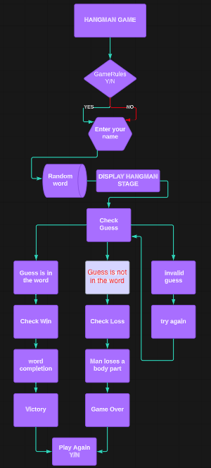
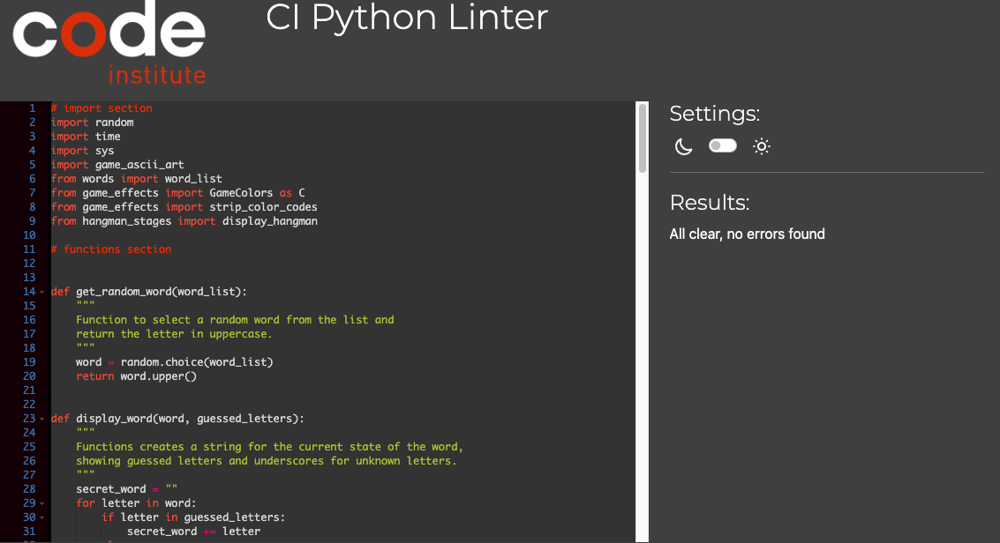

# Hangman Game

The Hangman Game application provides users with the opportunity to engage in a classic game of chance against the computer. The gameplay commences with the user inputting their name. Subsequently, the game displays successive stages of the hangman from its initial stage while also selecting a random word, concealed at the onset of the game. Throughout the game, the player's objective is to guess the letters forming the chosen word correctly, with six lives corresponding to the hangman's body parts - head, body, right arm, left arm, right leg, and left leg. The outcome of each round is determined by the player's success in guessing the correct letters of the word.

Throughout the game, the user may encounter three potential scenarios when making a letter choice: the letter is present in the word, the letter is not part of the word, or the letter has been previously guessed by the player. Additionally, any input other than a single letter will be considered invalid, and it will not result in the deduction of a life.

Once the game is over the user is presented with the option to initiate another round or exit the application.

## Table of Contents
+ [UX](#ux "UX")
  + [Site Purpose](#site-purpose "Site Purpose")
  + [Audience](#audience "Audience")
  + [Communication](#communication "Communication")
  + [Current User Goals](#current-user-goals "Current User Goals")
  + [New User Goals](#new-user-goals "New User Goals")
  + [Future Goals](#future-goals "Future Goals")
+ [Design](#design "Design")
   + [Mock-up](#mock-up "Wireframes")
+ [Features](#features "Features")
  + [Existing Features](#existing-features "Existing Features")
    + [Landing Page](#landing-page "Landing Page")
    + [Play Again](#play-again "Play Again or Quit App")
  + [Features Left to Implement](#features-left-to-implement "Features Left to Implement")
+ [Testing](#testing "Testing")
  + [Validator Testing](#validator-testing "Validator Testing")
  + [Manual Testing](#manual-testing "Manual Testing")
  + [Bugs](#bugs "Bugs")
  + [Unfixed Bugs](#unfixed-bugs "Unfixed Bugs")
+ [Technologies Used](#technologies-used "Technologies Used")
  + [Main Language](#main-language "Main Language")
  + [Frameworks, Libraries & Programs](#frameworks-libraries-programs "Frameworks, Libraries & Programs")
+ [Deployment](#deployment "Deployment")
    + [Version Control](#version-control "Version Control")
    + [Page Deployment](#page-deployment "Page Deployment")
+ [Credits](#credits "Credits")
  + [Content](#content "Content")
  + [Acknowledgements](#acknowledgements "Acknowledgements")

## UX

### Site Purpose:
To provide a simple and fun platform where the user can try their luck and have fun anticipating the computer's random word of choice.

### Audience:
Designed for anyone passionate about games of chance and looking for a simple and fun platform to enjoy the classic hangman experience.

### Communication:
The game interface employs clear and colored print statements to guide users through each turn, ensuring an error-free and engaging gaming experience. This color-coded approach enhances text readability and adds a visually appealing element to the game.

### Current User Goals:
The primary goal for current users is to be entertained and engaged by playing multiple rounds of the Hangman Game in succession. 

### New User Goals:
New users are encouraged to experiment with the computer-based version of the old-fashioned Hangman Game and experience the thrill of guessing random words.

### Future Goals:
Make the game more challenging by introducing multiple difficulty levels for the user to choose to play and implementing a scoring leaderboard.

### Mock-up:

[Back to top](<#table-of-contents>)

## Features

### Existing Features:

#### Landing Page:

The landing page displays the title of the game, the name of the developer, and a section with game rules. Next, the player has the choice to read the rules of the game or dive straight to play the game. Below this section, there is a prompt for the user to enter their name to begin the game.

#### Possible Outcomes:

The player may encounter three potential scenarios when making a letter choice: 
+ The letter `is` present in the word, the letter  `is not` part of the word.
+ The letter has been previously guessed by the player. 
+ Additionally, any input other than a single letter will be considered invalid, and it will not result in the deduction of a life.

#### Play Again:

Whether the player wins or loses the game, a banner of `Play Again` with its current `Victory` or `Game Over` will be displayed. The player has the option to continue playing or quit the game.

### Features Left to Implement
- Keep track of the scores for each gaming session and create a leaderboard to store the best scores
- Implement multiple difficulty levels.

[Back to top](<#table-of-contents>)

## Testing

### Validator Testing
- The code has been tested by using [CI PEP8 Online](https://pep8ci.herokuapp.com/). 
The only error originally found was a blank line left at the end of the file. 

### Manual Testing

### Bugs
- The issue I encountered was an ANSI escape codes for colors (e.g., [31m) being included in the text I am passing to the typewriter() function. The issue is that the colorama.init(autoreset=True) line is resetting the color codes to their default values after each call to typewriter(), which was causing the color codes to be stripped. To fix this, I needed to avoid resetting the color codes automatically. Instead, I manually reset the color codes after calling the typewriter() function and I created the colors.strip_color_codes() function for this purpose. In the game_effects file, I attached the resource link to fix this issue.

- Another issue I found was when the text statements from the game were displaying on the console, the hangman stage and the letter were also being affected by their color so I  manually reset the color codes with print(C.Reset) after calling the typewriter() or print()function, I ensure that the colors will not affect the hangman and word in the terminal.

[Back to top](<#table-of-contents>)

## Technologies Used
### Main Language
- Python Language

### Frameworks, Libraries & Programs
- [Visual Studio Code](https://code.visualstudio.com/) - used as the coding environment.
- [GitHub](https://github.com/) - to store the repository for submission.
- [Lucid](https://www.lucidchart.com) - to create the mock-up in preparation for the project.
- [Patorjk](http://patorjk.com/software/taag/#p=display&h=0&v=0&f=Big&t=HANGMAN%0AYOU%20WON!%0AGAME%20OVER%0APLAY%20AGAIN) - to create text to ASCII Art for the logo and banners layout for the game.
- [Heroku](https://id.heroku.com/)- to deploy the live version of the terminal
- [Words](https://www.hangmanwords.com/words) -the source of words for the game.
- Random - to randomize the choices of the computer player.
- Colorama - to add text readability by adding a touch of color to the print statements and overall enhanced user experience.

[Back to top](<#table-of-contents>)

## Deployment
### Version Control
The version control was maintained using git within Visual Studio Code to push code to the main repository.

 * From the VS Code terminal type `"git add ."`, to make changes and/or updates to the files.

 * Type `"git commit -m (insert a short descriptive text)"`, which commits the changes and updates the files.

 * Use the `"git push"` command, which pushes the committed changes to the main repository. 

 ### Page Deployment

 Visit the live deployment [Hangman Game]()

 [Back to top](<#table-of-contents>)

 ## Credits
As an initial inspiration, I watched the following YouTube tutorials by:
- [Kylie Ying](https://www.youtube.com/watch?v=cJJTnI22IF8)
- [Kite](https://www.youtube.com/watch?v=m4nEnsavl6w&t=3s)

To understand and implement the logic required for the game, I found the following article:
- [CodeFather](https://codefather.tech/blog/hangman-game-python/)

The following pages were consulted throughout the coding process:
+ [Time: Sleep](https://www.learndatasci.com/solutions/python-timer/) - as a reference how to add the execution time before the game begins. 
+ [How to Use Colorama in Python](https://linuxhint.com/colorama-python/) - source built-in Python modules to display the text in different colors.
+ [How To Print Colored Text in Python (Colorama Tutorial)](https://www.youtube.com/watch?v=u51Zjlnui4Y) - to learn how to add text color in the print statements to enhance the overall user experience.
+ [How to Add ASCII Art Text Banner to a Python Program](https://www.youtube.com/watch?v=Xh7bEIvUQfM) - to learn how to add ASCII Art Text Banner.
+ [Typewriter effect in Python](https://replit.com/talk/learn/Typewriter-effect-Python/139897) - to add typewriter effect in the text.

 [Back to top](<#table-of-contents>)

 ## Acknowledgments

 [Back to top](<#table-of-contents>)

## Creating the Heroku app
When you create the app, you will need to
You must then create a _Config Var_ called `PORT`. Set this to `8000`
If you have credentials, such as in the Love Sandwiches project, you must create another _Config Var_ called `CREDS` and paste the JSON into the value field.
Connect your GitHub repository and deploy as normal.